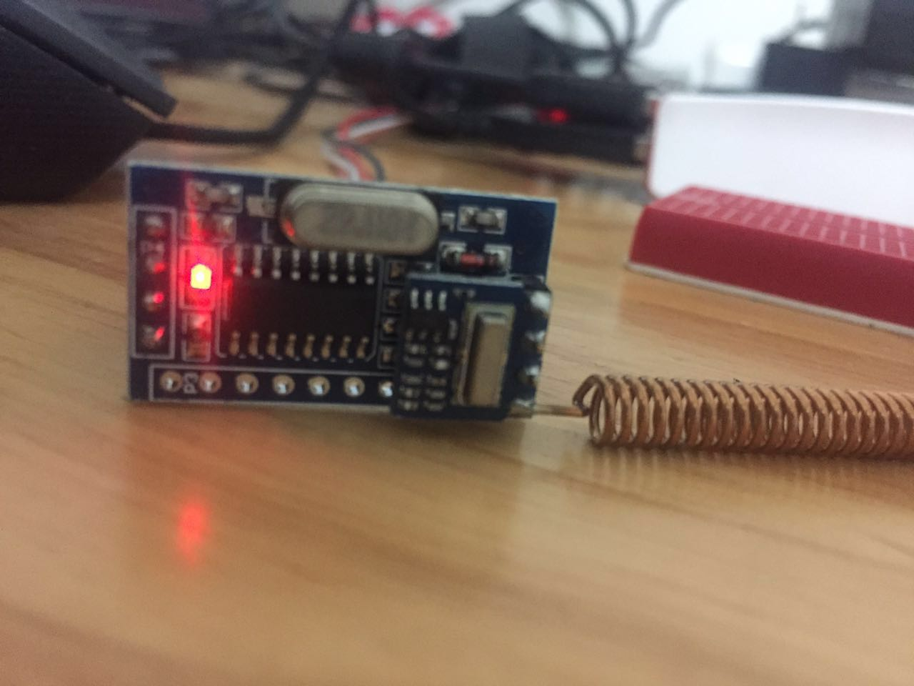

# 我的智能家居解决方案 #

### 射频控制电灯等简单电路 ###

##### 射频开关使用 #####

学习型开关,可学习toggle,总开,总关等信号,220V,130W 频率433.92MHz

##### 射频发射模块(带编码) #####

射频遥控模块,带编码,通信方式串口

	0xDF 0x03 0x01 0x01 0x01 0xA0 0xFD 

固定 长度 地址 地址 键码 震荡 固定

homekit

homebridge

rf433射频

红外
